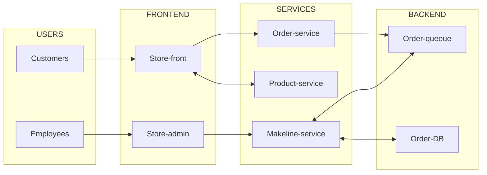

# Best Buy Cloud Native Application
Welcome to the Best Buy Cloud-Native Demo Application, a microservices-based reference system built using the Algonquin Pet Store (On Steroids) architecture. This project represents a realistic, production-style cloud-native application designed to demonstrate modern full-stack development, containerization, and Kubernetes orchestration patterns.


## Architecture

The application has the following services: 

| Service | Description | Github Repo |  Docker Image |
| --- | --- | --- | --- |
| `store-front` | Web app for customers to place orders (Vue.js) | [store-front](https://github.com/chui0005/store-front-best-buy) | [store-front-image](https://hub.docker.com/repository/docker/chui0005/store-front-best-buy)  |
| `store-admin` | Web app used by store employees to view orders in queue and manage products (Vue.js) | [store-admin](https://github.com/chui0005/store-admin-best-buy) | [store-admin-image](https://hub.docker.com/repository/docker/chui0005/store-admin-best-buy/general)  |
| `order-service` | This service is used for placing orders (Javascript) | [order-service](https://github.com/chui0005/order-service-best-buy) | [order-service-image](https://hub.docker.com/repository/docker/chui0005/order-service-best-buy/general)  |
| `product-service` | This service is used to perform CRUD operations on products (Rust) | [product-service](https://github.com/chui0005/product-service-best-buy) | [product-service-image](https://hub.docker.com/repository/docker/chui0005/product-service-best-buy/general)  |
| `makeline-service` | This service handles processing orders from the queue and completing them (Golang) | [makeline-service](https://github.com/chui0005/makeline-service-best-buy) | [makeline-service-image](https://hub.docker.com/repository/docker/chui0005/makeline-service-best-buy/general)  |

The application uses MongoDB as a stateful data store, deployed alongside stateless services, to demonstrate real-world data persistence considerations in Kubernetes environments.

This demo emphasizes:
- Microservices and API-first design
- Event-driven communication patterns
- Containerization and Kubernetes deployment
- Separation of concerns between frontend, backend, and worker services
- Realistic cloud-native operational architecture suitable for enterprise environments like Best Buy

### Logical Application Architecture Diagram




## [Deployment to Azure Kubernetes Service (AKS)](https://learn.microsoft.com/en-us/azure/aks/learn/quick-kubernetes-deploy-portal?tabs=azure-cli)

1. Provision the AKS cluster 
2. Deploy the AKS cluster
3. Using kubectl connect to the new cluster

    ```
    az aks get-credentials \
      --resource-group <RESOURCE_GROUP_NAME> \
      --name <CLUSTER_NAME>
    ```
4. Verify connection
    ```
    kubectl get nodes
    ```
5. Apply config-maps.yaml  (in Deployment Files)
    ```
    kubectl apply -f config-maps.yaml
    ```
6. Apply aps-all-in-on.yaml (in Deployment Files)
    ```
    kubect  apply -f aps-all-in-on.yaml
    ```

7. Check if pods are ready. 
    ```
    kubectl get pods
    ```
    if not, wait for all pods to become ready. 

8. Access sites by copying the EXTERNAL-IP
    ```
      Store Front: http://<STORE_FRONT_EXTERNAL_IP>/
      Store Admin: http://<STORE_ADMIN_EXTERNAL_IP>/
    ```


## Demo Video
[My demo](https://youtu.be/p4wEwilJKjk)
